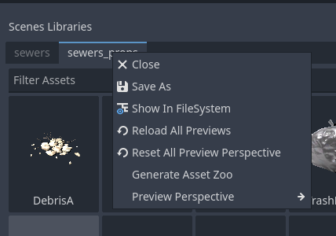
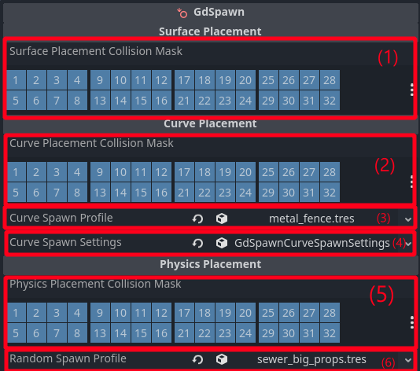

Interface
=========

Main Dock
-------------------

The main dock allows you to create libraries and select the current placement mode.

.. image:: ../images/interface.png

#. The Scene Palette is where you can create and use scene libraries, just drag and drop .tscn files and save to a SceneLibrary resource on your project files.

#. You can choose which node to spawn scenes under either by drag and drop or by selecting a node and clicking the button.

#. You can filter by scene names.

#. You can select a node in the scene and click this button to select the correspondig scene in the scene palette.

#. Drag to set the thumbnail size for the items in the current library.

#. Select the current placement mode.

#. You can detach the main dock to make use of a second monitor.

For each scene in the scene palette you have a few options, mainly to set the thumbnail preview. There are a few presets for the preview, or you can have a custom 
angle for the preview by opening the dynamic preview and orbiting/zooming with middle mouse button.

.. image:: ../images/preview_options.png

.. image:: ../images/dynamic_preview.gif

You can set the preview for the entire library by right clicking on the library name. The individual scene preview have higher priority than the library settings.
In the project settings you can set a global preview preset that has the lowest priority and is overridden by libraries settings and individual scenes settings.
	

Layers Dock
-------------------
The Layer Explorer allows you to create layers to organize your scene hierarchy.

.. image:: ../images/layers_dock.png

#. Create a new layer under the selected layer (if no layer is selected create a new root layer).

#. You can browse and select the layers here and hide/show individual layers or delete them (the children are not automatically deleted).

#. Filter layers by name.

#. Show the selected layers.

#. Hide the selected layers.

#. Delete the selected layers(the children of this layer will not be deleted).

#. Set the current selected layer as a Spawn Parent.

#. Add the selected nodes in the scene to selected layer.

#. Select layer in the scene tree.

GdSpawn Node
-------------------
The GdSpawn node is required to set the collision masks for the Surface, Curve, Physics Placement Modes, and their spawn profiles.

#. Surface Placement Mode collision mask.

#. Curve Placement Mode collision mask.

#. Curve Placement Spawn Profile (see :doc:`curve_placement`).

#. Curve Placement Spawn Settings (see :doc:`curve_placement`).

#. Physics Placement Mode collision mask.

#. Physics Placement Spawn Profile (see :doc:`physics_placement`).

