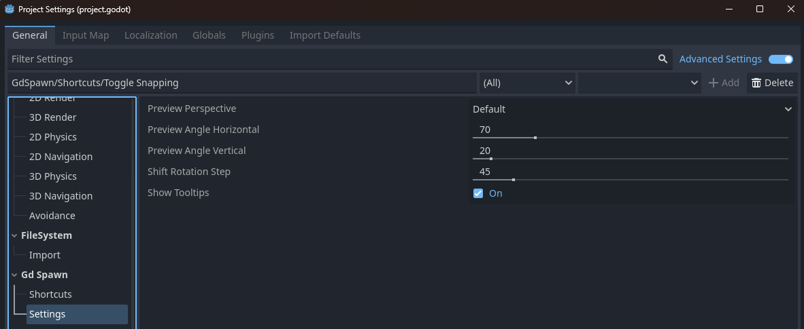

Settings and Configuration
=============================

In the Project Settings you can configure the GdSpawn settings and shortcuts. You have to turn on Advanced Settings.

#. Global thumbnail preview preset, can be overridden by libraries and scenes individual presets.

#. Angles of the global preview thumbnail when the preset is Default.

#. Rotation increment when pressing :kbd:`Shift`.

#. Enable Tooltips in the 3D editor main window.

Theese are the shourtcuts you can edit.

.. list-table::
   :widths: 65 35
   :header-rows: 1

   * - Action
     - Keybinding
   * - Rotate 90 degrees around X
     - :kbd:`A`
   * - Rotate 90 degrees around Y
     - :kbd:`S`
   * - Rotate 90 degrees around Z
     - :kbd:`D`
   * - Reset transformation
     - :kbd:`Shift+E`
   * - Select previous asset (when none selected)
     - :kbd:`Space`
   * - Place and select Modifier
     - :kbd:`Alt`
   * - Temporarely disable snapping
     - :kbd:`Ctrl`
   * - Move plane (in plane placement mode)
     - :kbd:`G`
   * - Flip on X axis
     - :kbd:`1`
   * - Flip on Y axis
     - :kbd:`2`
   * - Flip on Z axis
     - :kbd:`3`
   * - Select YZ plane (in plane placement mode)
     - :kbd:`Z`
   * - Select XZ plane (in plane placement mode)
     - :kbd:`X`
   * - Select XY plane (in plane placement mode)
     - :kbd:`C`

